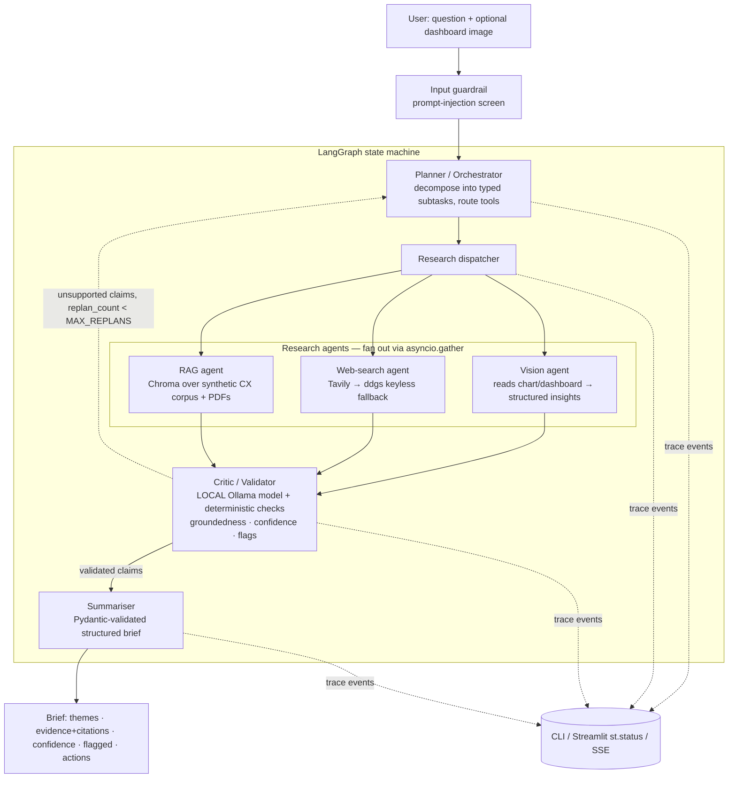

# Prism — Architecture Overview

Prism is a multi-agent research assistant. The orchestrator splits one question
into a spectrum of sub-tasks — the way a prism splits light — gathers and
cross-validates evidence across the web, internal documents, and a dashboard
image, and returns a structured, cited, confidence-scored brief.

It is a **LangGraph state machine** with four agents in clear role separation,
a bounded re-plan loop, deterministic-first guardrails, and one
framework-agnostic core driven from a CLI, a Streamlit demo, and a FastAPI
surface.

## 1. Topology



The compiled graph (auto-exported from LangGraph via `core.graph.export_diagram`)
is in [`diagram.mmd`](./diagram.mmd): `planner → research → critic`, with the
critic's two conditional edges — `replan → planner` and `summarise → summariser`.

## 2. Agents & interaction protocol

| Agent | Role | Model (role) | Output |
|---|---|---|---|
| **Planner / Orchestrator** | Decompose the question into 2–4 typed subtasks (`rag` / `web` / `vision`), guarantee ≥2 evidence subtasks, drive the re-plan loop | `light` / `heavy` | `Plan(subtasks)` |
| **Researcher (fan-out)** | Run subtasks concurrently (`asyncio.gather`); each routes to its tool; synthesise one grounded claim per subtask | `light` | `list[Finding]` |
| **Vision** | Send the dashboard image (base64) to a multimodal model; extract categories %, NPS trend, anomalies | `vision` (hosted multimodal) | `Finding(source_type="vision")` |
| **Critic / Validator** | Per claim: deterministic `cites_source` → lexical groundedness → LLM verdict; emit confidence + flags; bounce unsupported claims | `critic` (**local-first**) | `CriticReport` |
| **Summariser** | Compose the Pydantic-validated brief; refuse to assert anything the critic could not ground | `heavy` | `ResearchBrief` |

**Interaction is a real handoff, not a pipeline.** Researchers *generate*; the
critic *judges*; unsupported claims trigger a bounded **re-plan** back to the
planner (`MAX_REPLANS=2` circuit breaker, mirroring the repo's `MAX_TURNS`
pattern). The independence of the critic (a different model *family* than the
generators — local Ollama vs hosted) is the core anti-hallucination story:
decorrelated errors.

## 3. State

```python
class ResearchState(TypedDict):
    question: str
    image_path: str | None
    subtasks: list[SubTask]
    findings: list[Finding]          # {claim, source_type, source_ref, subtask_id}
    critic_report: CriticReport      # per-claim grounded?/confidence + flags
    replan_count: int                # circuit breaker
    final: ResearchBrief | None
    trace: list[dict]                # streamed to every front end (operator.add)
```

Every boundary is a Pydantic model (`core/schemas.py`); the `trace` list
accumulates across nodes and is what the CLI, Streamlit `st.status` panel, and
the `/research` SSE stream all render — one source of truth.

## 4. Tiered model routing (the cost/capability lever)

Role-based routing (`core/byok.py`) degrades through a **quality-first** ladder
per role, then falls back to the local model only as a last resort:

| Role | Ladder |
|---|---|
| `light` / `heavy` | gemini-flash → flash-lite → claude → **qwen2.5:1.5b** (last resort) |
| `vision` | gemini-flash → flash-lite → claude *(hosted multimodal only — non-fatal if none)* |
| `critic` | **qwen2.5:1.5b** (first) → flash-lite → flash → haiku |

This tier boundary is deliberate and is itself the production story:

- **Critic runs local by design** — decorrelated errors *and* $0 cost (the cost
  lever). A 1.5B model is noisy, so the critic combines its verdict with a
  *deterministic* lexical-groundedness signal for robustness.
- **Planning, synthesis, and all vision are hosted** — a small local model
  plans/synthesises poorly, and a low-RAM CPU box cannot run a chart-capable
  vision model (the small local VLMs both don't fit and read charts poorly).
- **Environment-aware** — on the laptop the critic is local Ollama; in a
  no-Ollama cloud deploy the same role-router falls back to a hosted small
  model. Nothing about the code changes between environments.

## 5. Tools

- **Web search** — Tavily when keyed, **ddgs (keyless) fallback** auto-detected,
  so the repo runs with no search key. Tools return errors as strings; failures
  are logged to stderr (`[tool-error]`), never silent.
- **RAG** — Chroma `PersistentClient` over a synthetic CX corpus, embeddings via
  Chroma's ONNX `DefaultEmbeddingFunction` (all-MiniLM-L6-v2, **no torch**).
  Hash-incremental indexing; a threading lock serialises first-time init across
  the async fan-out. `get_collection()` is the documented swap seam for a Chroma
  server / Pinecone / Weaviate.
- **PDF** — `pdfplumber` loader for uploaded documents.
- **Vision** — handled by the multimodal LLM call, not a separate OCR stack.

## 6. Guardrails & evaluation (deterministic-first)

Demonstrated, not just described (`core/guardrails.py`, `eval/`):

1. **Deterministic checks first (no LLM):** `cites_source` (every asserted claim
   carries a source ref) and Pydantic schema validation at every boundary.
2. **Groundedness / hallucination detection:** each claim is checked against its
   cited source. Lexical overlap grounds a faithful restatement *by
   construction*; the LLM critic catches semantic drift. A claim with no source
   and low overlap stays `UNSUPPORTED` and is excluded or re-researched.
3. **Cross-agent validation:** generators (hosted) vs critic (local) — different
   model families ⇒ decorrelated errors. The re-plan loop is the visible
   interaction.
4. **Confidence scoring:** per-claim score from source agreement + grounding
   strength, surfaced as badges in every front end and as an overall brief score.
5. **Input guardrail (OWASP-LLM01):** a prompt-injection screen over the user
   question before it enters any prompt.
6. **Eval harness (`eval/run_eval.py`):** a labelled set (grounded / hallucinated
   / no-source / out-of-knowledge) scoring groundedness accuracy + cites_source,
   plus a **regression demo** — weaken the grounding bar and watch accuracy fall
   (0.909 → 0.545). Runs offline, keyless, in CI.

## 7. Production thinking

### Built for real
- **Containerised:** multi-stage `Dockerfile` (slim, non-root, healthcheck) runs
  the FastAPI surface; `docker-compose.yml` wires the app + a persistent Chroma
  volume, with explicit `mem_limit`/`cpus`. Ollama runs on the host via
  `OLLAMA_HOST` to respect the RAM budget.
- **Health & readiness:** `/health` (liveness) and `/ready` (corpus + provider
  reachable) surface failures at startup, not mid-request.
- **12-factor config:** all config via env (`core/config.py`); no keys in the
  image or git. Cloud Run Secret Manager is the prod path.
- **Structured logging + trace IDs:** `core/logging_config.py` emits one JSON
  object per line; a per-request `trace_id` is threaded through telemetry, the
  SSE `X-Trace-Id` header, and the token/cost accounting — one id end to end.
- **CI:** ruff + pytest + eval smoke, green with **no live keys**.
- **Tests:** tool contracts, schema validation, the planted-unsupported-claim
  guardrail catch, the async-fan-out concurrency race, and the API surface.

### Scaling (write-up)
Stateless workers (Streamlit / FastAPI hold no durable state) behind a load
balancer; async concurrency + research fan-out for throughput; long jobs streamed
over SSE so no request blocks; Cloud Run autoscaling on concurrency. The
LangGraph checkpointer moves from in-memory (demo) to a durable backend
(Postgres / Firestore) for resumability. A two-layer cache (exact + semantic)
cuts cost and tail latency under load.

### Monitoring — each tied to an `obs.py` hook
- **Quality** — groundedness sampled via the eval harness; **flagged-claim rate**
  as a live SLI; the prompt-degradation regression test guards releases.
- **Cost** — per-agent, per-provider token + cost accounting (`by_model`);
  critic-on-local-model is the deliberate cost lever; cost attributed per
  `trace_id`.
- **Latency** — per-agent spans → p50/p95 from the trace log; fan-out shrinks
  wall time; cache hits short-circuit. Alert on p95 regressions.
- **Reliability** — BYOK fallback chain + tenacity retries + non-fatal vision =
  graceful degradation under quota/auth failure (proven: the system completes
  end-to-end on the local model alone when every hosted provider is down).

## 8. CX application

The same architecture serves the telecom CX surface — swap the corpus and the
dashboard, keep the agents:

- **Complaint triage** — decompose "top complaint drivers," ground categories in
  the internal KB, cross-check against external benchmarks, return prioritised
  interventions.
- **Call-centre insight mining** — RAG over call transcripts / verbatims.
- **NPS root-cause analysis** — the dashboard's NPS trend + complaint categories
  feed a grounded "why is NPS down" brief.

All data here is **synthetic** (no customer PII); category figures are grounded
in public regulator disclosures (CCTS / FCC / Ofcom), cited in
`data/corpus/SOURCES.md`.
